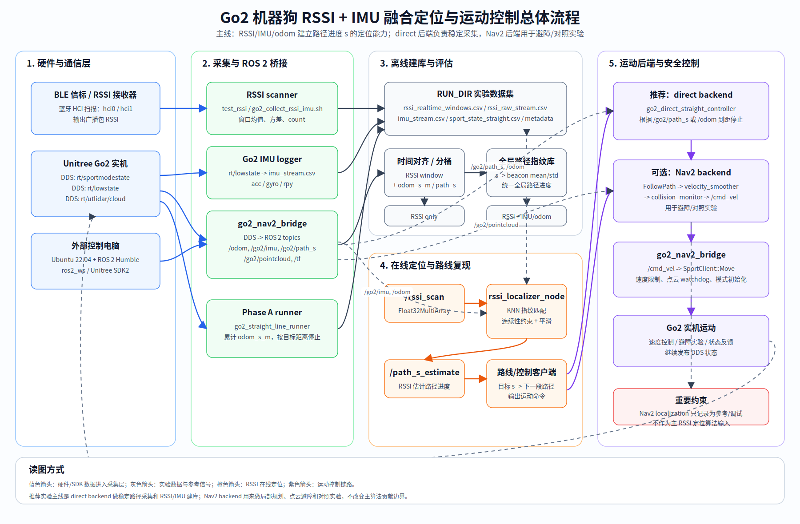

# Go2 Motion Bridge for RSSI Collection

## Goal

The stable Phase A collection path uses a lightweight ROS 2 Go2 bridge plus a direct straight-line controller. RSSI/IMU/odom remain the localization research signals.

## System Overview



Editable source: `docs/figures/go2_rssi_system_overview.mmd`

The current split is:

- Direct controller: publish `/cmd_vel` until `/go2/path_s` or `/odom` reaches the requested distance.
- Go2 bridge: convert `/cmd_vel` to Unitree `SportClient::Move`, initialize Go2 walking mode, and publish Go2 odom/IMU/path progress as standard ROS 2 topics.
- Nav2 Controller: optional experimental backend for later local-planning/obstacle-avoidance comparisons.
- RSSI pipeline: collect RSSI windows and compare `RSSI only` vs `RSSI + IMU/odom`.

Nav2 localization output should not be used as an input to the RSSI localization algorithm in the main method. It can be logged as a reference/debug signal.

## Why Run New Nav2 on an External Computer

The Go2 computer logs have shown ROS 2 Foxy paths. Foxy is old, and the latest Nav2 targets newer ROS 2 distributions. Running the latest Nav2 directly on the Go2 system is likely to hit dependency and ABI issues.

Recommended setup:

1. External computer: Ubuntu 22.04 with ROS 2 Humble, Nav2, this repo's `ros2_ws`.
2. Go2 side: Unitree SDK2 DDS interface only.
3. Bridge node: talks to Unitree SDK2 on the Go2 network and exposes standard ROS 2 topics to Nav2.

This keeps Go2 firmware/SDK interaction small and lets Nav2 stay close to upstream.

## Data Flow

```text
Go2 DDS rt/sportmodestate      -> go2_nav2_bridge -> /odom, /go2/imu, /tf, /go2/path_s
go2_direct_straight_controller -> /cmd_vel
/cmd_vel                       -> go2_nav2_bridge -> SportClient::Move
RSSI scanner + IMU logger      -> run directory CSV files
```

The `MOVE_BACKEND=direct` path is the recommended no-obstacle straight collection backend. Use `MOVE_BACKEND=nav2` when testing Nav2-provided local planning and obstacle protection.

Nav2 obstacle chain:

```text
Nav2 FollowPath controller -> /cmd_vel_nav
velocity_smoother          -> /cmd_vel_smoothed
collision_monitor          -> /cmd_vel
go2_nav2_bridge            -> SportClient::Move
```

The bridge publishes `/go2/pointcloud` in `base_link` by default. If the Unitree cloud is actually in the lidar sensor frame, calibrate:

```yaml
go2_nav2_bridge:
  ros__parameters:
    point_cloud_xyz_offset: [0.0, 0.0, 0.0]
    point_cloud_rpy_offset: [0.0, 0.0, 0.0]
```

Do not trust wall clearance until `/go2/pointcloud` looks correct in RViz with `Fixed Frame=base_link` or `odom`.

## Build on the External Computer

Install ROS 2 and Nav2 first. On Ubuntu 22.04, use ROS 2 Humble. Do not use `lyrical`: it is not an apt distribution for Ubuntu 22.04. Jazzy targets Ubuntu 24.04, so use it only in a separate Ubuntu 24.04 install/container, not on the current 22.04 Go2 development machine.

```bash
cd /home/luping/桌面/RSSI/RSSI/code/ros2_ws
source /opt/ros/humble/setup.bash
colcon build --packages-select go2_nav2_bridge
source install/setup.bash
```

If you intentionally use a Ubuntu 24.04/Jazzy environment:

```bash
source /opt/ros/jazzy/setup.bash
colcon build --packages-select go2_nav2_bridge
source install/setup.bash
```

If Unitree SDK2 is elsewhere:

```bash
colcon build --packages-select go2_nav2_bridge --cmake-args -DUNITREE_SDK2_DIR=/path/to/unitree_sdk2
```

## 1 m Straight Collection Test

```bash
cd /home/luping/桌面/RSSI/RSSI/code
source /opt/ros/humble/setup.bash
source ros2_ws/install/setup.bash

RUN_DIR="$HOME/go2_rssi_runs/direct_test_1m" \
MOVE_BACKEND=direct RSSI_MODE=off MAX_RUNTIME_SEC=20 \
scripts/go2_collect_straight_line_nav2.sh enp5s0 1.0 0.20 1.0 0.5
```

With the RSSI receiver on the Go2 computer:

```bash
RUN_DIR="$HOME/go2_rssi_runs/direct_1m_rssi" \
MOVE_BACKEND=direct \
RSSI_MODE=remote \
ROBOT_SSH=unitree@192.168.123.18 \
ROBOT_PROJECT_DIR=/home/unitree/rssi_go2 \
ROBOT_NETWORK_INTERFACE=eth0 \
BT_TTY=/dev/ttyACM1 \
DIRECT_DISTANCE_SOURCE=path_s \
MAX_RUNTIME_SEC=25 \
scripts/go2_collect_straight_line_nav2.sh enp5s0 1.0 0.20 1.0 0.5
```

## Nav2 Obstacle Test

Start with a short, slow run in open space with a soft obstacle far in front. This uses Nav2 costmap and collision monitor; it is not the same as the direct backend.

```bash
RUN_DIR="$HOME/go2_rssi_runs/nav2_obstacle_0p5m_rssi" \
MOVE_BACKEND=nav2 \
RSSI_MODE=remote \
ROBOT_SSH=unitree@192.168.123.18 \
ROBOT_PROJECT_DIR=/home/unitree/rssi_go2 \
ROBOT_NETWORK_INTERFACE=eth0 \
BT_TTY=/dev/ttyACM1 \
MAX_RUNTIME_SEC=20 \
scripts/go2_collect_straight_line_nav2.sh enp5s0 0.5 0.12 1.0 0.5
```

If this fails, inspect:

```bash
tail -n 220 "$RUN_DIR/nav2_launch.log"
cat "$RUN_DIR/remote_rssi_preflight.log"
cat "$RUN_DIR/remote_rssi.log"
```

Only increase to 1 m after `/go2/pointcloud`, local costmap, and collision monitor zones are visually correct.

The script starts:

- Bluetooth RSSI scanner, unless `RSSI_MODE=off`.
- Go2 IMU logger.
- `go2_nav2_bridge`.
- `go2_direct_straight_controller`, which stops when `/go2/path_s` reaches `distance_m`.

Main outputs:

- `rssi_realtime_windows.csv`
- `rssi_raw_stream.csv`
- `imu_stream.csv`
- `nav2_launch.log`
- `run_metadata.txt`

## Tuning First

The most important parameters are in:

```text
ros2_ws/src/go2_nav2_bridge/params/go2_nav2_minimal_controller_params.yaml
```

Start with these before changing code:

| Parameter | Meaning |
|---|---|
| `go2_nav2_bridge.classic_walk_on_start` | enables stable walking mode before velocity commands |
| `go2_nav2_bridge.speed_level_on_start` | Unitree speed level; currently `1` |
| `go2_direct_straight_controller.distance_source` | `path_s`, `odom`, or `time` stopping reference |
| `go2_direct_straight_controller.control_hz` | direct command rate |
| `go2_direct_straight_controller.start_delay_sec` | delay before first nonzero velocity |

For Nav2 obstacle tests, tune:

```text
ros2_ws/src/go2_nav2_bridge/params/go2_nav2_straight_params.yaml
```

Key parameters:

| Parameter | Meaning |
|---|---|
| `go2_nav2_bridge.publish_point_cloud` | must be `true` for obstacle-aware Nav2 |
| `point_cloud_xyz_offset`, `point_cloud_rpy_offset` | lidar-to-base correction if needed |
| `local_costmap.plugins` | should include `voxel_layer` and `inflation_layer` |
| `inflation_layer.inflation_radius` | wall safety margin |
| `collision_monitor.FrontStop` | hard stop zone in front of the robot |
| `collision_monitor.BodySlow` / `SideSlow` | slowdown zones for close obstacles/walls |
| `FollowPath.max_vel_y`, `max_vel_theta` | allows Nav2 to do lateral/yaw correction |

If the robot accepts commands but stops early, inspect `nav2_launch.log` for `sport_state path_s`, `vel`, `mode`, `gait`, and `error`.

## RSSI-Guided Route Reproduction

The first integration uses direct closed-loop path progress to reproduce a straight path. The next step is to make RSSI generate path progress guidance:

1. Offline collection: use Nav2 to collect repeatable straight and turning paths.
2. Train/evaluate:
   - `RSSI only`
   - `RSSI + IMU/odom`
3. Online route reproduction:
   - RSSI estimates path progress `s`.
   - IMU/odom maintains short-term continuity.
   - A route client converts the desired next path segment into direct `/cmd_vel` or optional Nav2 path commands.
   - Optional Nav2 Controller experiments can be used later for local-planning and obstacle-avoidance baselines.

This keeps the project thesis clear: RSSI/IMU provides localization and path progress guidance; the motion backend provides repeatable locomotion without becoming the main research contribution.
